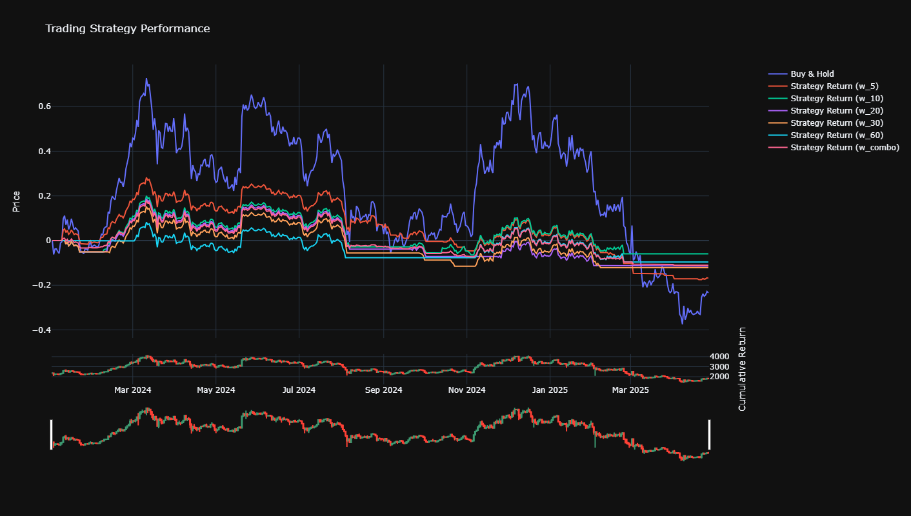
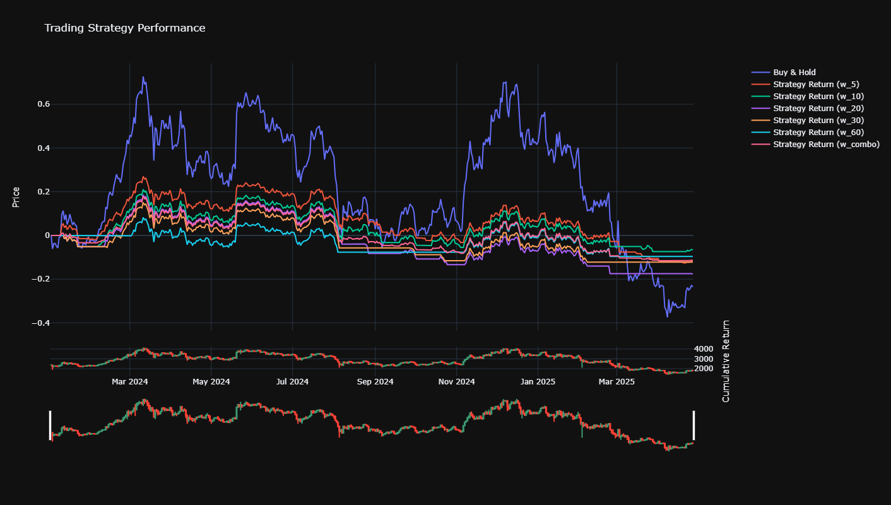

# Hyperliquid Trading Bot

A machine learning-based trading bot for the Hyperliquid exchange, using PyTorch and CatBoost for predictions. The bot implements real-time market data streaming, ML-based signal generation, and automated order execution with risk management.

# Strategy

Results after simple parameter optimization for base strategy

__Binance__
|    CAGR |   CumulativeReturns |   AnnualizedVolatility |   SharpeRatio |   SortinoRatio |   MaxDrawdown |   CalmarRatio |   BuyAndHold | window   |
|--------:|--------------------:|-----------------------:|--------------:|---------------:|--------------:|--------------:|-------------:|:---------|
| 36.0114 |              428.9  |                63.7871 |      0.644782 |       0.747605 |      -75.0605 |      0.479765 |       1082.8 | w_5      |
| 74.0052 |             1907.97 |                61.0349 |      0.924117 |       1.02034  |      -50.8563 |      1.45518  |       1082.8 | w_10     |
| 65.4952 |             1430.47 |                60.1888 |      0.873812 |       0.889435 |      -66.1162 |      0.990606 |       1082.8 | w_20     |
| 89.3328 |             3071.82 |                60.6608 |      1.02667  |       0.985721 |      -67.1698 |      1.32995  |       1082.8 | w_30     |
| 70.3516 |             1689.98 |                63.4281 |      0.895727 |       0.873456 |      -71.7603 |      0.980369 |       1082.8 | w_60     |
| 76.1943 |             2048.63 |                54.8934 |      0.980877 |       1.23257  |      -54.3865 |      1.40098  |       1082.8 | w_combo  |

__Hyperliquid__
|    CAGR |   CumulativeReturns |   AnnualizedVolatility |   SharpeRatio |   SortinoRatio |   MaxDrawdown |   CalmarRatio |   BuyAndHold | window   |
|--------:|--------------------:|-----------------------:|--------------:|---------------:|--------------:|--------------:|-------------:|:---------|
| 10.3376 |             58.5822 |                61.8429 |      0.412716 |       0.473046 |      -75.2231 |      0.137426 |      341.752 | w_5      |
| 46.3604 |            496.175  |                58.3217 |      0.735466 |       0.795159 |      -50.878  |      0.911208 |      341.752 | w_10     |
| 38.3127 |            357.35   |                57.3012 |      0.673458 |       0.657799 |      -66.1513 |      0.579168 |      341.752 | w_20     |
| 59.093  |            781.413  |                57.6415 |      0.842662 |       0.766941 |      -66.8436 |      0.884049 |      341.752 | w_30     |
| 55.694  |            696.557  |                60.7423 |      0.804823 |       0.786016 |      -71.3425 |      0.780656 |      341.752 | w_60     |
| 49.2433 |            553.252  |                52.0611 |      0.785485 |       0.968451 |      -54.2044 |      0.908475 |      341.752 | w_combo  |

And results for ml-filtered strategy

__Binance__


__Hyperliquid__



## Project Structure

```
.
├── src/                    # Source code
│   ├── trading/           # Trading components
│   │   ├── connection.py  # Hyperliquid API connection
│   │   ├── market_data.py # Market data streaming
│   │   └── order_manager.py # Order management
│   ├── data/              # Data collection and processing
│   │   └── market_data.py # Market data collector
│   ├── strategy/          # Strategy
│   │   ├── donchian.py    # Base strategy
│   │   └── donchian_modified.py # Base strategy with ml filtering
│   └── settings.py        # Configuration settings
├── data/                  # Data storage
├── dump/                  # ML models
├── notebooks/             # Jupyter notebooks
├── backtest/              # Back test
├── ml/                    # training filters
└── scripts/               # Utility scripts
```

## Features

- Real-time market data streaming from Hyperliquid
- ML-based trading signal generation
- Automated order execution
- Risk management with stop-loss and take-profit
- Position tracking and management
- Comprehensive logging

## Setup

1. Clone the repository:
```bash
git clone <repository-url>
cd hyperliquid-trading-bot
```

2. Create and activate virtual environment:
```bash
python -m venv .venv
source .venv/bin/activate  # On Windows: .venv\Scripts\activate
```

3. Install dependencies:
```bash
pip install -r requirements.txt
```

4. Copy environment variables:
```bash
cp .env.example .env
```

5. Edit `.env` file with your Hyperliquid API credentials and other settings.

## Configuration

The bot can be configured through environment variables in the `.env` file:

```env
# Required Settings
HYPERLIQUID_SECRET_KEY=your_private_key_here

COIN=BTC
LOOK_BACK_WINDOWS = {5, 10, 20, 30, 60, 90, 150, 250, 360}
TARGET_VOLATILITY = 0.25
MAX_ALLOCATION = 2.0
VOLATILITY_WINDOW = 90
TRADING_DAYS_PER_YEAR = 252
RISK_FREE_RATE = 0.0
```

## Usage

1. Start the trading bot:
```bash
python3 main.py
```

